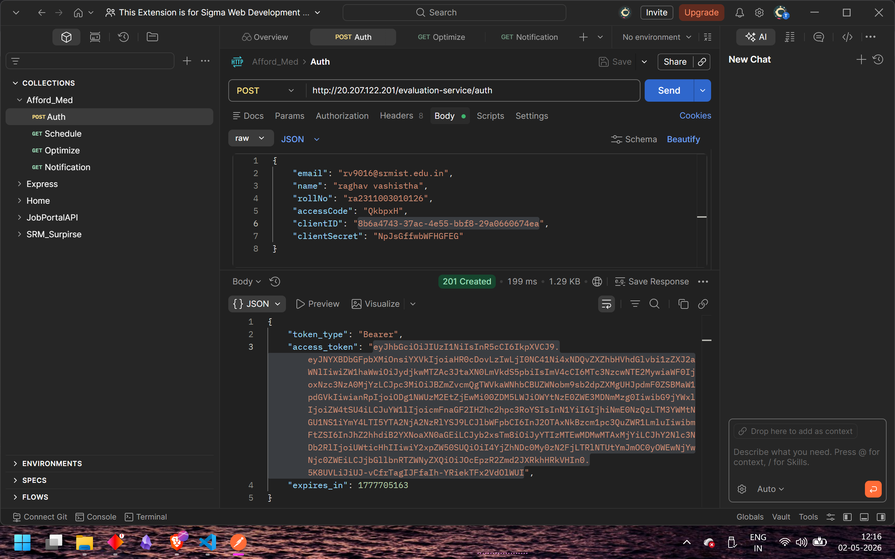
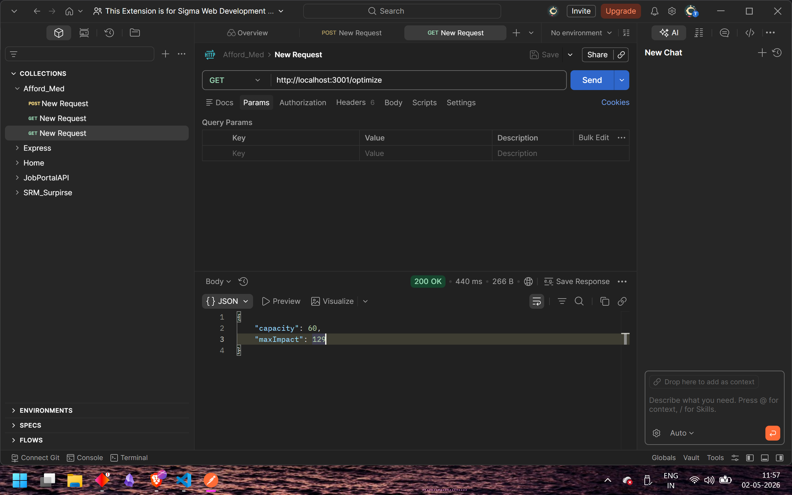
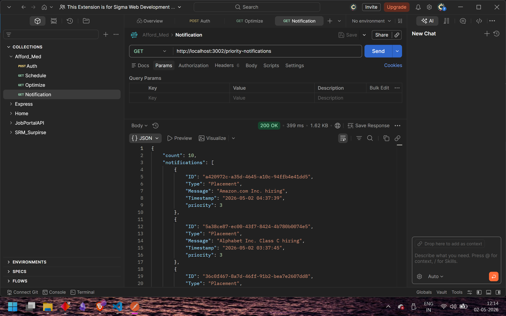
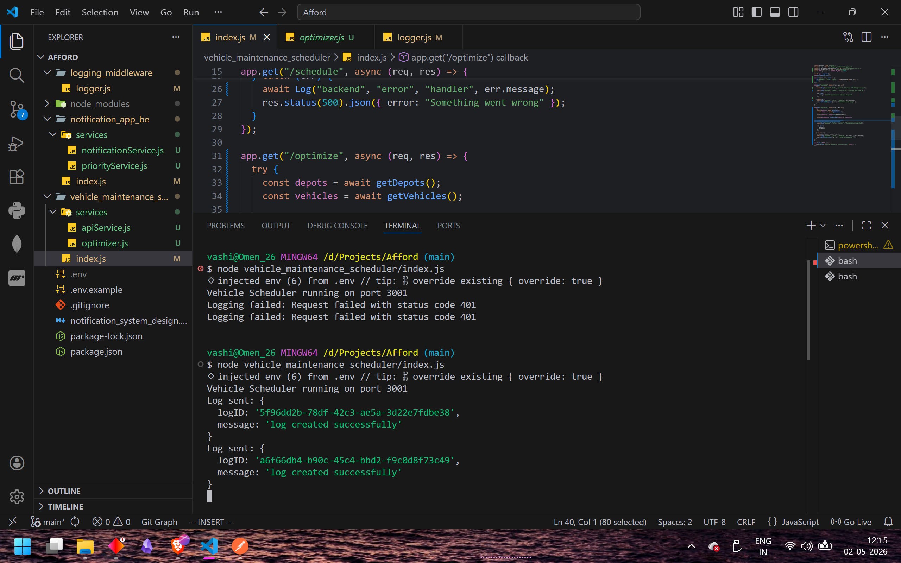
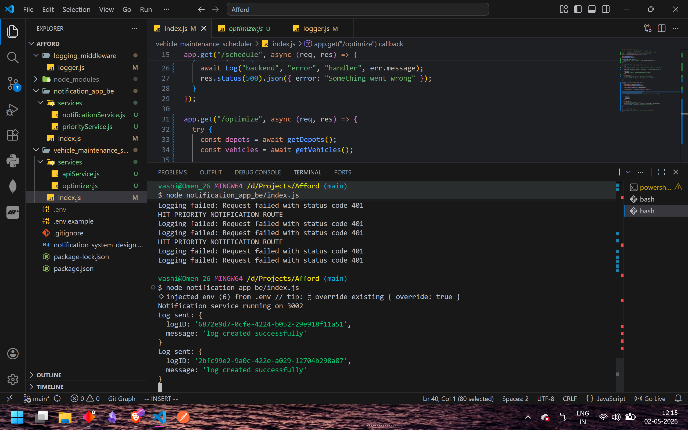

# RA2311003010126
# AffordMed Backend Assignment

##  Overview
This project implements a backend system consisting of:

-  Logging Middleware (centralized logging system)
-  Vehicle Maintenance Scheduler Microservice
-  Campus Notification Microservice

All services are integrated with the provided **AffordMed Test Server APIs** and follow the required constraints.

---

##  Tech Stack

- Node.js
- Express.js
- Axios
- dotenv

---

##  Project Structure
Afford/
│
├── logging_middleware/
│ └── logger.js
│
├── vehicle_maintenance_scheduler/
│ ├── index.js
│ └── services/
│ ├── apiService.js
│ └── optimizer.js
│
├── notification_app_be/
│ ├── index.js
│ └── services/
│ ├── notificationService.js
│ └── priorityService.js
│
├── screenshots/
│
├── .env
├── package.json
└── notification_system_design.md


## ⚙️ Setup Instructions

### 1 Clone the repository
```bash
git clone <your-repo-link>
cd Afford
```
### 2 Install dependencies
npm install

### 3️ Create .env file
CLIENT_ID=your_client_id
CLIENT_SECRET=your_client_secret
ACCESS_TOKEN=your_access_token
BASE_URL=http://20.207.122.201/evaluation-service

SCHEDULER_PORT=3001
NOTIFICATION_PORT=3002

### Running the Services
Vehicle Scheduler
```
node vehicle_maintenance_scheduler/index.js
```

### Notification Service
```
node notification_app_be/index.js
```

### API Endpoints

#### 1. Authentication
POST http://20.207.122.201/evaluation-service/auth

#### Get Schedule
GET http://localhost:3001/schedule

#### Optimize Maintenance
GET http://localhost:3001/optimize

**Sample Response:**
```json
{
  "capacity": 60,
  "maxImpact": 129
}
```

### 4. Priority Notifications
GET http://localhost:3002/priority-notifications

---

## Logging Middleware

A reusable logging function is implemented:
```javascript
Log(stack, level, package, message)
```

**Features:**
- Sends logs to external test server
- Validates inputs (stack, level, package)
- Used across all services
- Integrated via middleware and service layers

---

## Approach

### Vehicle Optimization
- Solved using Greedy / Knapsack approach
- **Goal:**
  - Maximize total impact
  - Stay within mechanic-hour constraints

### Notifications
- Fetched from API
- Assigned priority:
  - Placement → High
  - Event → Medium
  - Others → Low
- Sorted and top 10 returned

---

## Screenshots

- Authentication API


- Optimize API


- Notifications API


- Scheduler Logs (Terminal)


- Notification Logs (Terminal)


---

## Features Implemented

- Centralized logging middleware
- Authenticated API integration
- Vehicle maintenance optimization logic
- Priority-based notification system
- Error handling with logging
- Modular microservice architecture

---

## Conclusion

The system successfully fulfills all assignment requirements:
- Proper API integration
- Robust logging system
- Efficient optimization logic
- Clean modular structure

---

